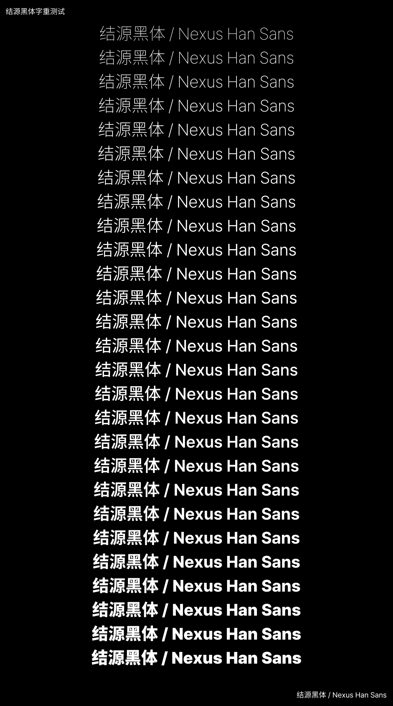

# 结源黑体 / Nexus Han Sans

结源黑体（Nexus Han Sans）是一套以 [Source Han Sans](https://github.com/adobe-fonts/source-han-sans) 为 CJK、[Pretendard Std](https://github.com/orioncactus/pretendard) 为 Latin 的开源黑体字体，参考 [Dream Han Sans](https://github.com/Pal3love/dream-han-cjk) 提供 W01 - W27 共 27 字重。

## 下载与安装

请前往本仓库的 GitHub Releases 页面下载最新版本的 ZIP 压缩包，解压后即可得到 TTF、TTC 或 Super TTC 字体文件。当前页面的 “Code” 下载仅包含构建脚本、源文件说明和项目文档，不包含字体成品。

如果是在本地自行构建，请在构建完成后直接从 `release/TTF`、`release/TTC` 或 `release/SuperTTC` 目录获取字体文件。

Windows 用户建议在字体文件上单击右键，选择“为所有用户安装”，以避免部分软件无法找到用户目录字体。

## 协议

本字体以 [SIL Open Font License 1.1](https://openfontlicense.org/) 发布，可免费用于商业用途。字体文件可二次修改和再分发，但不得使用上游字体的 Reserved Font Name 作为修改后字体名称。

本项目使用的最终字体名称为：

* `结源黑体 SC` / `Nexus Han Sans SC`
* `結源黑體 TC` / `Nexus Han Sans TC`
* `結源黑體 HC` / `Nexus Han Sans HC`
* `結ノ角ゴ JP` / `Nexus Han Sans JP`
* `결본고딕 KR` / `Nexus Han Sans KR`

## 特性

本项目使用 Source Han Sans Variable 作为 CJK 母版，Latin 字形来自 Pretendard Std Variable。整体规格以 Dream Han Sans 为参照，并按 SC、TC、HC、JP、KR 提供区域版本。

### 技术规格

* **样式**：W01 - W27 共计 27 字重
* **区域版本**：SC、TC、HC、JP、KR
* **CJK 来源**：Source Han Sans SC/TC/HC/JP/KR
* **Latin 来源**：Pretendard Std
* **字重插值**：采用与 Dream Han Sans 相同的 W01 - W27 插值方式，Latin 使用独立校准曲线匹配 CJK 粗细
* **异体字支持**：简、台繁、港繁、日、韩
* **OpenType 功能**：保留 CJK 竖排、区域字形和标点相关布局数据
* **Adobe 行高**：采用与 Dream Han Sans 相同的标准行高修正
* **Microsoft Office Style-Link**：W12 为 Regular，W22 为 Bold
* **Microsoft Office 字体嵌入**：支持 Word、Excel、PowerPoint 等软件的字体嵌入功能
* **封装格式**：TTF、按字重分组的 TTC，以及包含全部区域和全部字重的 Super TTC
* **曲线格式**：TrueType 二次贝塞尔曲线
* **曲线精度（UPM, units per em）**：2048
* **屏显渲染策略**：采用与 Dream Han Sans 相同的全字号亚像素抗锯齿设置
* **数字签名显示**：写入空 `DSIG` 表，用于兼容 Windows 字体查看器的“已数字签名”显示
* **版本格式**：`Version 1.00; Source 2.005`，其中 Source 版本随上游 Source Han Sans 同步



## 编译

### 平台依赖

推荐在 WSL/Linux 环境中构建。请先安装：

* Python 3.8 及以上
* `pip`
* `fonttools`
* `skia-pathops`
* `toml`
* Node.js 20 及以上
* npm

安装 Python 依赖：

```bash
python3 -m venv .venv
. .venv/bin/activate
python -m pip install -r requirements.txt
```

安装 Node 依赖：

```bash
npm install
```

### 源文件准备

请参考 `sources/README.md` 放置上游字体源文件。如果当前目录结构与本工作区一致，可以直接导入本地已有源文件：

```bash
python3 tools/sync_upstreams.py
```

检查源文件：

```bash
python3 tools/check_sources.py
```

### 执行脚本

WSL/Linux：

```bash
./script/build_fonts.sh wsl 12
```

PowerShell：

```powershell
.\script\build_fonts.ps1 -Jobs 12
```

其中最大并行数决定最多并行处理的字体数量。TTF 合并阶段内存占用较高，如果机器开始交换内存，请把并行数降到 2-4；内存充足时可以提高到 CPU 核心数附近。

字重参数支持单个字重、逗号列表、空格列表和范围，例如 `12`、`10,12,15,20,22`、`"10 12 15 20 22"` 或 `1-27`。

先测试单个字重：

```bash
./script/build_fonts.sh wsl 12 12
```

```powershell
.\script\build_fonts.ps1 -Jobs 12 -Weights 12
```

全量构建会生成：

* `release/TTF`：每个区域、每个字重一个 TTF
* `release/TTC`：每个字重一个 TTC，包含 SC、TC、HC、JP、KR
* `release/SuperTTC/NexusHanSans-Super.ttc`：包含 SC、TC、HC、JP、KR 的 W01 - W27 全部字体
* `release/ZIP`：上述格式的压缩包

### GitHub Actions

`Check Upstream Releases` 会定期检查 Source Han Sans 与 Pretendard 是否有新版；如果发现更新，会自动创建 PR 通知维护者。

`Build Release Packages` 可手动运行，下载上游源文件后以并行数 12 构建 ZIP，也可选择生成 draft release。

## 鸣谢

* [Source Han Sans](https://github.com/adobe-fonts/source-han-sans)
* [Pretendard](https://github.com/orioncactus/pretendard)
* [Dream Han CJK](https://github.com/Pal3love/dream-han-cjk)
